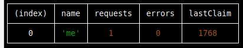

# pixelversexyzBOT
autoclaim bot for https://t.me/pixelversexyzbot

## run@linux
```
git clone git@github.com:maanimis/pixelversexyzBOT.git 
cd pixelversexyzBOT
```
edit headers[tg-id,username,secret,initData] from index.js and save it:
```
nano index.js
```
install dependencies:
```
npm i
```

run:
```
npm start
```



